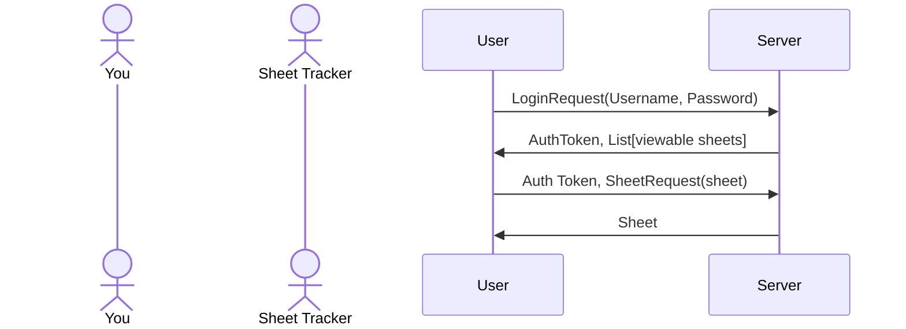
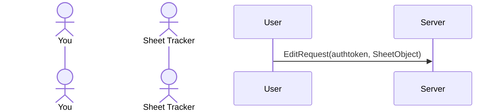

# Stormlight RPG Character Tracker

[My Notes](notes.md)

I love role playing games, and I love the Stormlight archive, so naturally I got really excited when the Cosmere RPG was released, and have been looking over the rules and system since it was released. For my startup project, I wanted to make something that I would want to use, but that didn't currently exist in a form that I can easily access. So, for this project I am going to make a Cosmere RPG online character sheet, for me and my players to use. 

### Primary Goals
I have several different stages of progress I would like to make, ordered in prioritized by what is most necessary to get a basic version working. In order I will:
 - Make a web application that can help you create your character
 - Store this information on a server
 - Support login on any device to access your sheets for use and modification.
### Secondary Goals
After these things are working, I have the following secondary goals to work on now or after the class is over:
 - Share access to the character sheet with Game Masters and other players
 - Display skill trees
 - Display full descriptions in a sidebar when you click on them
 - Roll dice and calculate values for specific actions
 - Mange combat encounters

>  If you are not familiar with Markdown then you should review the [documentation](https://docs.github.com/en/get-started/writing-on-github/getting-started-with-writing-and-formatting-on-github/basic-writing-and-formatting-syntax) before continuing.

## 🚀 Specification Deliverable

> [!NOTE]
>  Fill in this sections as the submission artifact for this deliverable. You can refer to this [example](https://github.com/webprogramming260/startup-example/blob/main/README.md) for inspiration.

For this deliverable I did the following. I checked the box `[x]` and added a description for things I completed.

- [x] Proper use of Markdown
- [x] A concise and compelling elevator pitch
- [x] Description of key features
- [x] Description of how you will use each technology
- [x] One or more rough sketches of your application. Images must be embedded in this file using Markdown image references.

### Elevator pitch
Role playing games are immensely popular, and there are a multitude of useful web applications which are quite successful. Now, if there are so many of these, why would we bother with making more of the same? Well, recently a new rpg based on the best selling book series *The Stormlight Archive* was released, and initial distribution has begun. This game works on a different system than most popular games, and doesn't have many of the online resources that are seen as fairly basic to most players and game masters. My startup project aims to provide many of these resources in a format that will be appreciated by role play enjoyers, and fans of Stormlight.

### Design

The first and most essential goal is to make you able to access your character sheets anywhere you are. So, for our starting design we will focus on authentication, storage, and access. Interaction with the server will look like this:

Sheet modification, once you are logged in, will work almost completely on the side of the user using React, just checking your auth token before saving the changes when they are sent to the server.

### Key features

The most key features will be my primary goals:
 - Support character creation
 - Store character sheets information on a server database
 - Support login on any device to access your sheets for use and modification.

### Technologies

I am going to use the required technologies in the following ways.

- **HTML** - Create the basic formatting and store the actual character information once the user receives it
- **CSS** - Present the information in a visually appealing way
- **React** - Sheet modification and interactivity
- **Service** - Provide accesibility and authentication services
- **DB/Login** - Store the actual current sheet information
- **WebSocket** - Update sheets across platforms as needed

## 🚀 AWS deliverable

For this deliverable I did the following. I checked the box `[x]` and added a description for things I completed.

- [x] **Server deployed and accessible with custom domain name** - [My server link](https://yourdomainnamehere.click).

## 🚀 HTML deliverable

For this deliverable I did the following. I checked the box `[x]` and added a description for things I completed.

- [x] **HTML pages** - I made 4 separate HTML pages. One for the login screen, one for displaying the Character Sheet, one for Combat tracking, and the last just for referencing rules that you may want to see when you're in combat.
- [x] **Proper HTML element usage** - Every one of my html files have the same header, footer, and nav sections, as I'm pretty sure all of them will benefit from having access to all of them. The Main and Body sections vary drastically in each, but they all exist!
- [x] **Links** - there are links in the nav section that allow you to go to all of the other pages. I also have one or two others for providing images and such.
- [x] **Text** - Oh there is so much text. I've been working on this part in codepen for a bit now, which led to a few extremely large commits.
- [x] **3rd party API placeholder** - I want to have the combat tracker be able to play music. For now, I just have a broken youtube link that I added in to be completely replaced by api access at a later date.
- [X] **Images** - I put in appropriate images in each of the sections. One will eventually hopefully be replaced by a file input.
- [x] **Login placeholder** - my main page is my login page. Input boxes are placeholders
- [x] **DB data placeholder** - The character sheet will rely heavily on database access to get the actual numbers. For now randomly chosen numbers have been put in until such a time as I get this set up.
- [x] **WebSocket placeholder** - The combat tracker is intended to be communicating with everyone who has joined a particular combat. For now a single row has been placed to hold the spot for players as they join.

## 🚀 CSS deliverable

For this deliverable I did the following. I checked the box `[x]` and added a description for things I completed.

- [ ] **Header, footer, and main content body** - I did not complete this part of the deliverable.
- [ ] **Navigation elements** - I did not complete this part of the deliverable.
- [ ] **Responsive to window resizing** - I did not complete this part of the deliverable.
- [ ] **Application elements** - I did not complete this part of the deliverable.
- [ ] **Application text content** - I did not complete this part of the deliverable.
- [ ] **Application images** - I did not complete this part of the deliverable.

## 🚀 React part 1: Routing deliverable

For this deliverable I did the following. I checked the box `[x]` and added a description for things I completed.

- [ ] **Bundled using Vite** - I did not complete this part of the deliverable.
- [ ] **Components** - I did not complete this part of the deliverable.
- [ ] **Router** - I did not complete this part of the deliverable.

## 🚀 React part 2: Reactivity deliverable

For this deliverable I did the following. I checked the box `[x]` and added a description for things I completed.

- [ ] **All functionality implemented or mocked out** - I did not complete this part of the deliverable.
- [ ] **Hooks** - I did not complete this part of the deliverable.

## 🚀 Service deliverable

For this deliverable I did the following. I checked the box `[x]` and added a description for things I completed.

- [ ] **Node.js/Express HTTP service** - I did not complete this part of the deliverable.
- [ ] **Static middleware for frontend** - I did not complete this part of the deliverable.
- [ ] **Calls to third party endpoints** - I did not complete this part of the deliverable.
- [ ] **Backend service endpoints** - I did not complete this part of the deliverable.
- [ ] **Frontend calls service endpoints** - I did not complete this part of the deliverable.
- [ ] **Supports registration, login, logout, and restricted endpoint** - I did not complete this part of the deliverable.

## 🚀 DB deliverable

For this deliverable I did the following. I checked the box `[x]` and added a description for things I completed.

- [ ] **Stores data in MongoDB** - I did not complete this part of the deliverable.
- [ ] **Stores credentials in MongoDB** - I did not complete this part of the deliverable.

## 🚀 WebSocket deliverable

For this deliverable I did the following. I checked the box `[x]` and added a description for things I completed.

- [ ] **Backend listens for WebSocket connection** - I did not complete this part of the deliverable.
- [ ] **Frontend makes WebSocket connection** - I did not complete this part of the deliverable.
- [ ] **Data sent over WebSocket connection** - I did not complete this part of the deliverable.
- [ ] **WebSocket data displayed** - I did not complete this part of the deliverable.
- [ ] **Application is fully functional** - I did not complete this part of the deliverable.
